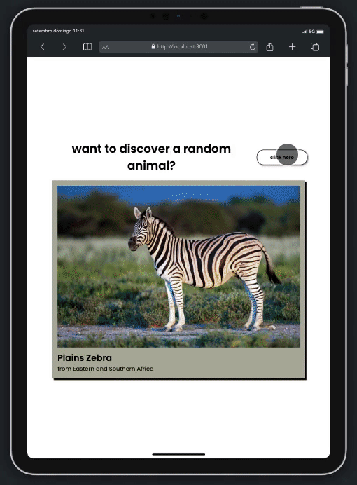
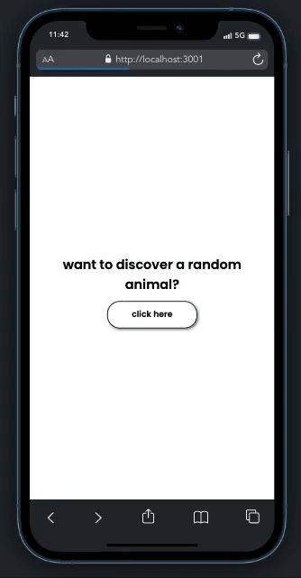

## Random Animals Project

<i>Projeto desenvolvido como desafio referente ao módulo 2 do curso Vai na Web de desenvolvimento front-end. </i>  

    
    
    
    

 

O projeto em questão foi desenvolvido para estudo e aprofundamento sobre o uso de APIs utilizando `react function component`.

Foi utilizada a <a href="https://zoo-animal-api.herokuapp.com">Zoo Animal API</a>, que traz informações diversas como peso, comprimento, habitat e dieta, entre outros.

No futuro, pretendo realizar melhorias no que tange ao método de requisição e armazenamento dos dados utilizados, para otimização de performance das imagens. A página também carece de compatibilidade mobile quando em landscape mode.

## PREVIEW

  
  
  

 

    

